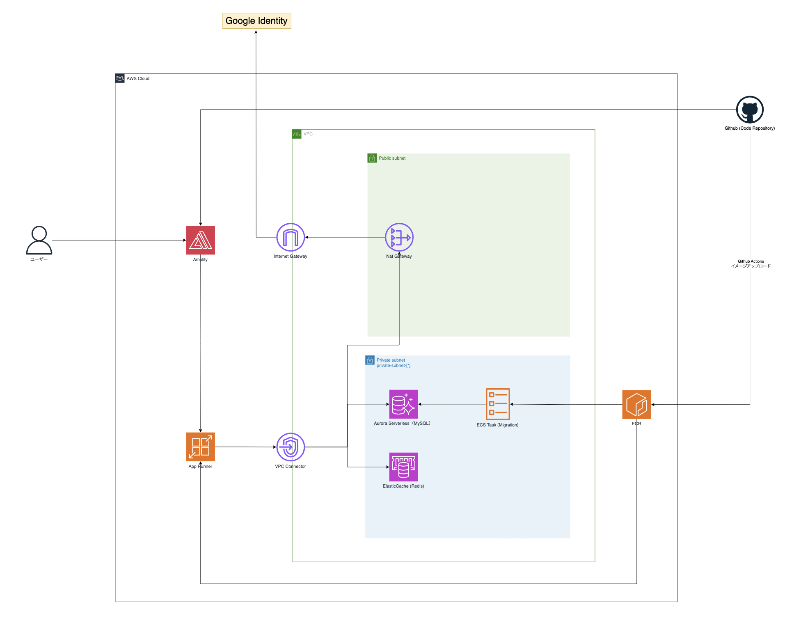

## BOILERPLATE__next-nest-gql-gauth

以下画像のAWSアーキテクチャ、および、つづく技術セットでアプリの大枠を作成するボイラープレート



### Backend

- Nest.js (Express)
- Graphql (Apollo)
- Prisma (MySQL)

### Frontend

- Next.js
- MUI
- React Query

### Infrastructure

- Terraform

### Other

- Redis (for Session)
- Google Identity
- lefthook

### Set Up

```
# rootディレクトリにいることを確認
pwd

# lefthook自体のインストールと設定
brew install lefthook
lefthook install

# git-secretsの設定
git secrets --install
git secrets --register-aws
```
